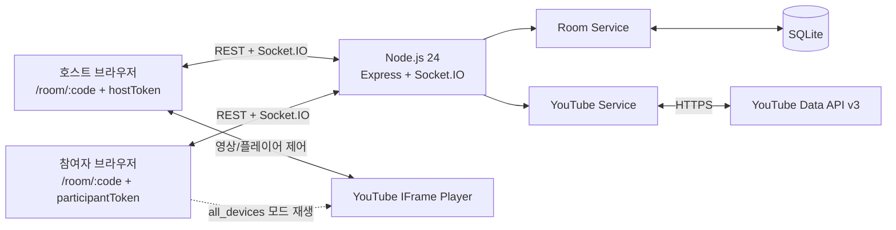
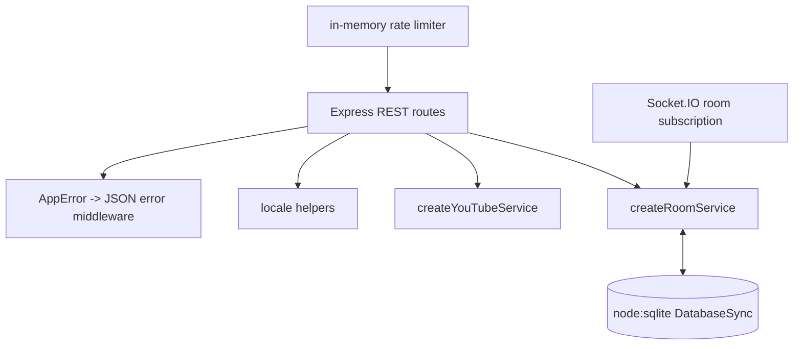
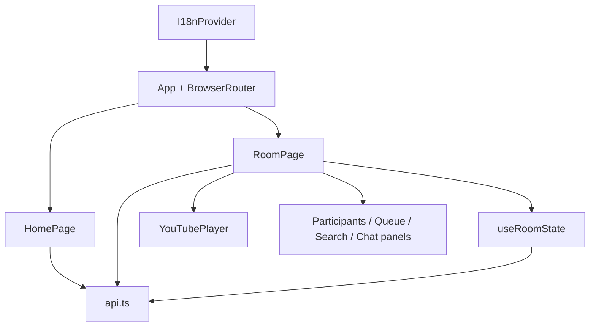
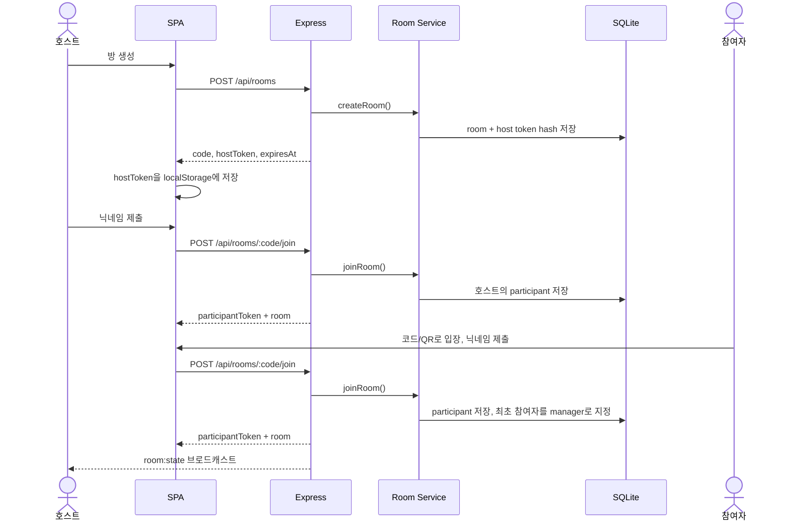
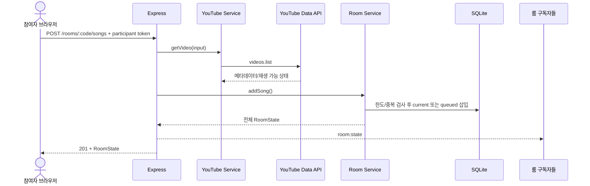
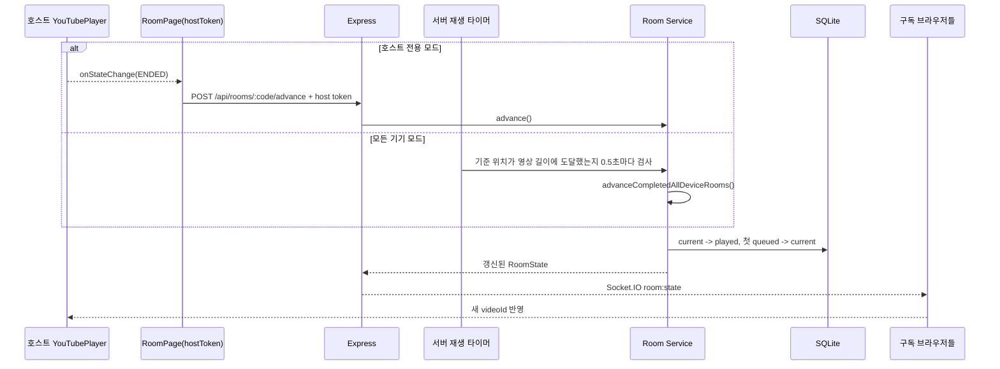
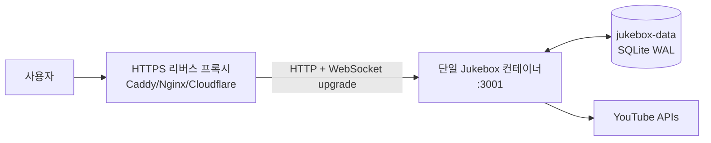

# 시스템 아키텍처

## 1. 아키텍처 요약

Jukebox는 하나의 Node.js 프로세스가 REST API, Socket.IO, 빌드된 SPA 정적 파일을 모두 제공하고 SQLite 파일 하나를 영속 저장소로 사용하는 모듈형 모놀리스입니다. 실제 미디어 스트림은 서버를 통과하지 않습니다. 방 생성 시 선택한 모드에 따라 호스트만 또는 호스트와 모든 참여자 브라우저가 YouTube에서 직접 재생합니다.

## 2. 런타임 컨테이너

| 컨테이너 | 책임 | 상태 |
| --- | --- | --- |
| 프런트 SPA | 화면, 토큰 보관, REST 명령, 룸 상태 구독, 선택 모드에 따른 영상 재생 | React state + `localStorage` |
| Express/Socket.IO 서버 | API 라우팅, 오류 변환, 룸 채널, 정적 파일 제공 | 인메모리 연결/제한/캐시 일부 |
| Room Service | 인증·권한, 한도, 중복, 곡 상태 전이, 설정, 공동 관리자 관리 | SQLite 트랜잭션 |
| YouTube Service | 입력 파싱, 외부 검색, 재생 가능성 검증 | 상태 없음 |
| SQLite | 방, 참여자, 곡, 채팅과 재생 제어 상태 | WAL 파일 |

## 3. 상태 소유권

영속 상태의 정본(source of truth)은 백엔드 SQLite이며, 현재 접속 상태만 Node.js 프로세스 메모리에서 관리합니다. 프런트는 낙관적으로 상태를 계산하지 않고, REST 응답 또는 `room:state` 이벤트로 받은 전체 스냅샷을 화면 상태로 사용합니다.

| 상태 | 정본 | 복제/캐시 |
| --- | --- | --- |
| 방 설정과 만료 시각 | `rooms` 테이블 | 모든 구독 브라우저의 `RoomState` |
| 현재 곡과 대기열 | `rooms.current_song_id`, `songs` | 모든 구독 브라우저의 `RoomState` |
| 재생 모드와 기준 타임라인 | `rooms` 테이블 | 모든 플레이어가 위치 계산 및 drift 보정에 사용 |
| 일시정지/자동재생 차단/볼륨 | `rooms` 테이블 | 호스트/참여자 플레이어와 매니저 UI |
| 참여자·매니저 | `participants.is_manager` | 공개 룸 상태 |
| 최근 채팅 | `chat_messages` | 인증된 참여자 브라우저의 최근 100개 상태 |
| 현재 접속 중인 참여자 | Node.js 메모리의 소켓별 presence | 공개 룸 상태의 참여자 목록 |
| 호스트/참여자 원본 토큰 | 각 브라우저 `localStorage` | 서버에는 SHA-256 해시만 저장 |
| 언어 선택 | 브라우저 `localStorage` | 서버는 최초 추천 로케일만 제공 |

## 4. 백엔드 레이어

### `server.js`: 애플리케이션 조립

- 환경 변수를 읽고 DB, 도메인 서비스, Express, HTTP 서버, Socket.IO를 생성합니다.
- 변경 API가 성공하면 `room:{정규화된 코드}` 채널로 `room:state`를 보내고, 새 채팅은 인증된 참여자 전용 `chat-room:{코드}` 채널로 보냅니다.
- `frontend/dist`를 정적 제공하며 SPA 경로는 `index.html`로 폴백합니다.
- 시작 시 한 번, 이후 1분마다 고정 만료 방과 1시간 이상 비어 있는 방을 삭제합니다.
- `SIGINT`와 `SIGTERM`에서 HTTP 서버와 DB를 닫습니다.

### `rooms.js`: 도메인 서비스

- 방 코드 및 고엔트로피 토큰 생성
- 호스트, 참여자, 매니저 자격 증명 검증
- 공개 `RoomState` 조립
- 방 내 활성 영상 중복 방지
- 현재 곡/대기열 전이, 순서 변경, 삭제
- 재생 모드·기준 위치·기준 시각·revision, 볼륨 상태 및 공동 관리자 관리
- 참여자 채팅 기록 저장과 최근 100개 조회
- 변경 작업의 SQLite 트랜잭션 처리

### `youtube.js`: 외부 API 어댑터

- 원시 영상 ID, `youtu.be`, watch, Music, Shorts, embed, live URL에서 영상 ID를 추출합니다.
- 검색 결과를 `videos.list`로 다시 조회해 공개·비라이브·임베드 가능 조건을 검증합니다.
- 직접 추가는 재생 가능한 영상만 허용합니다.
- 외부 요청 제한 시간은 10초입니다.

## 5. 프런트엔드 구조

### 라우트

| 경로 | 화면 | 역할 |
| --- | --- | --- |
| `/` | `HomePage` | 방 생성 또는 코드 입력 |
| `/room/:code` | `RoomPage` | 모든 사용자의 참여·신청 기능과 호스트 토큰 보유자의 추가 관리 기능 제공 |
| `/host/:code` | `LegacyHostRedirect` | 기존 호스트 URL을 통합 룸 경로로 리다이렉트 |
| 기타 | `/`로 이동 | SPA fallback |

### 상태 동기화 훅

`useRoomState(code, hostToken, participantToken)`는 두 경로로 동일 상태를 갱신합니다.

1. 마운트 시 `GET /api/rooms/:code`로 최초 스냅샷을 받습니다.
2. Socket.IO를 polling 우선으로 연결하고 토큰과 함께 `room:subscribe` 후 `room:state`를 계속 받습니다. 가능한 환경에서는 Socket.IO가 WebSocket으로 승격합니다. 유효한 호스트 또는 참여자 세션만 방의 활성 연결 수에 포함됩니다.

참여자 목록은 DB에 저장된 전체 세션이 아니라 현재 Socket.IO 연결이 있는 참여자만 표시합니다. 동일 참여자의 여러 탭은 소켓 단위로 집계하며 마지막 연결이 끊긴 뒤 5초 안에 재연결되면 새로고침으로 간주합니다. 유예 시간이 지난 뒤 온라인 매니저가 한 명도 없으면 현재 접속 중인 일반 참여자 가운데 가장 먼저 생성된 세션을 추가 매니저로 자동 승격합니다. 기존 매니저의 권한은 해제하지 않으므로 재접속 후에도 유지됩니다.

연결 직후와 30초 간격으로 `time:sync`를 호출해 서버와 브라우저 시계의 오차를 추정합니다. 모든 기기 모드의 플레이어는 기준 위치와 기준 서버 시각으로 예상 위치를 계산하고, 3초마다 실제 위치가 0.75초보다 크게 벗어나면 `seekTo()`로 보정합니다. 단, 플레이어가 `ENDED` 상태에 도달하면 다음 곡 상태를 받을 때까지 위치 보정과 재생 재시도를 중단합니다.

REST 변경 응답도 즉시 `setRoom`에 반영하므로, 이벤트 전달 전에 요청을 실행한 브라우저가 먼저 최신 UI를 볼 수 있습니다.

채팅은 유효한 참여자 토큰으로 최근 100개를 REST 조회하고, 같은 토큰으로 구독한 소켓에서 `chat:message`를 수신합니다. 최초 조회와 실시간 이벤트가 겹쳐도 메시지 ID로 중복을 제거하고 생성 시각·DB 순번으로 정렬합니다.

## 6. 핵심 시퀀스

### 방 생성과 참여

### 신청곡 추가

### 곡 종료와 다음 곡

### 매니저의 재생 제어

호스트 전용 모드에서 매니저 브라우저는 영상을 직접 재생하지 않으며 현재 곡 썸네일의 재생·정지 컨트롤로 호스트 플레이어를 원격 제어합니다. 모든 기기 모드에서는 매니저를 포함한 각 참여자 브라우저가 영상을 재생하므로 각 기기의 YouTube 플레이어에서 로컬 볼륨을 조절합니다. 호스트 또는 매니저가 재생 상태를 변경하면 서버에 저장해 브로드캐스트하고, 각 플레이어가 `playVideo()`, `pauseVideo()`, `seekTo()`를 적용합니다.

호스트 전용 모드에서 자동재생이 막히면 호스트가 `playback/autoplay-blocked`를 보고하고 서버가 전역 재생을 멈춥니다. 모든 기기 모드의 자동재생 차단은 기기별 상태이므로 다른 기기를 멈추지 않으며, 해당 플레이어의 `재생 계속` 버튼으로 사용자 상호작용을 확보한 뒤 현재 서버 위치로 이동합니다. 호스트 전용 모드의 곡 종료는 호스트 플레이어가 `advance`를 요청합니다. 모든 기기 모드는 특정 브라우저의 종료 이벤트에 의존하지 않고 서버가 0.5초마다 기준 타임라인과 영상 길이를 비교해 다음 곡으로 전환합니다.

## 7. 권한 모델

| 작업 | 공개 | 참여자 | 매니저 | 호스트 |
| --- | :---: | :---: | :---: | :---: |
| 공개 룸 상태 조회/구독 | O | O | O | O |
| 방 참여 | O | O | O | O |
| YouTube 검색/차트 조회 | O | O | O | O |
| 곡 추가 | X | O | O | X |
| 채팅 조회·전송 | X | O | O | X |
| 일시정지/재생 | X | X | O | O |
| 현재 곡 건너뛰기 | X | 본인 신청곡 | O | O |
| 대기열 곡 삭제 | X | 본인 신청곡 | O | O |
| 대기열 순서 변경 | X | X | O | O |
| 방 설정 변경 | X | X | O | O |
| 매니저 추가·해제 | X | X | O | X |
| 자동재생 차단 상태 보고 | X | X | X | O |

호스트는 참여자 레코드가 아니므로 곡을 직접 신청하지 않습니다. 일반 참여자는 `songs.added_by`가 자신의 참여자 ID인 곡만 삭제하거나 건너뛸 수 있으며, 매니저와 호스트는 모든 곡을 제어합니다. 매니저 추가·해제는 매니저의 참여자 토큰 기반이며 최소 한 명의 관리자를 유지합니다.

## 8. 보안 경계

- 원본 토큰은 생성 응답에서 한 번 반환되며 DB에는 SHA-256 해시만 저장됩니다.
- 호스트 토큰 비교는 `timingSafeEqual`을 사용합니다.
- JSON 요청 본문은 32KB로 제한됩니다.
- 검색은 IP/경로당 분당 30회, 일반 변경 API는 분당 120회로 제한됩니다. 채팅 조회·전송에는 별도 제한이 없습니다.
- YouTube API 키는 백엔드 환경 변수에만 존재합니다.
- 프로덕션 이미지는 비루트 `node` 사용자로 실행되며 배포 Compose는 읽기 전용 루트 파일시스템, capability 제거, `no-new-privileges`를 적용합니다.
- 서비스 자체는 TLS를 종료하지 않으므로 인터넷 공개 시 HTTPS 리버스 프록시가 필요합니다.

주의할 점은 브라우저의 `localStorage` 토큰이 같은 출처에서 실행되는 스크립트에 노출된다는 것입니다. 따라서 외부 스크립트 추가, HTML 주입, CSP 변경은 인증 경계 변경으로 취급해야 합니다.

## 9. 배포 토폴로지와 확장 한계

현재 권장 토폴로지는 단일 애플리케이션 인스턴스와 영속 볼륨 하나입니다.

다중 인스턴스로 전환하려면 최소한 다음 요소가 함께 바뀌어야 합니다.

- Socket.IO 룸 브로드캐스트를 위한 공유 어댑터
- 공유 요청 제한 및 인기 차트 캐시
- 여러 인스턴스가 안전하게 접근할 외부 데이터베이스
- 만료 정리 작업의 단일 실행 또는 분산 잠금

## 10. 주요 아키텍처 결정

| 결정 | 이유 | 트레이드오프 |
| --- | --- | --- |
| 전체 `RoomState` 브로드캐스트 | 클라이언트 병합 로직과 이벤트 순서 문제를 단순화 | 대기열/참여자가 커지면 전송량 증가 |
| 방 생성 시 재생 기기 모드 고정 | 스피커 중심 사용과 원격 공동 청취를 모두 지원 | 방을 만든 뒤에는 모드를 변경할 수 없음 |
| 서버 기준 재생 타임라인 + 클라이언트 보정 | 미디어를 중계하지 않고 여러 IFrame의 위치를 정렬 | 네트워크·버퍼링에 따라 짧은 오차가 남을 수 있음 |
| SQLite + 동기 API | 배포와 트랜잭션 코드가 단순 | 이벤트 루프 블로킹 가능성과 수평 확장 제한 |
| 토큰 기반 무계정 인증 | 빠른 참여와 개인정보 최소화 | 토큰 복구·철회·기기 간 이동이 어려움 |
| 생성 시 YouTube 메타데이터 복사 | 읽기 성능과 외부 API 의존 감소 | 원본 제목/썸네일 변경이 자동 반영되지 않음 |
| 고정 TTL + 빈 방 자동 삭제 | 사용하지 않는 방을 빠르게 정리하면서 최대 수명을 제한 | Socket.IO 연결 상태를 단일 서버에서 추적 |
