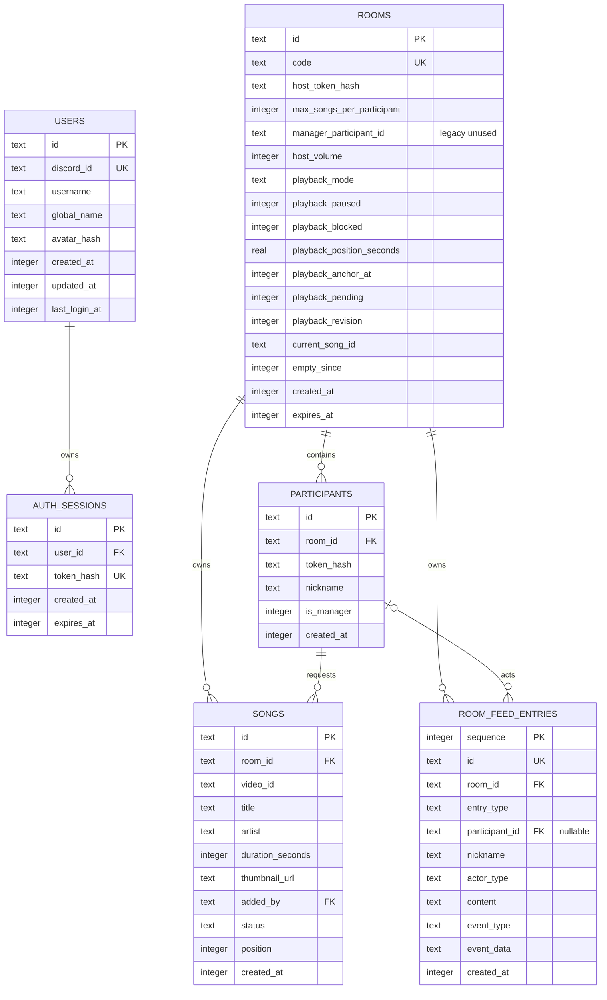
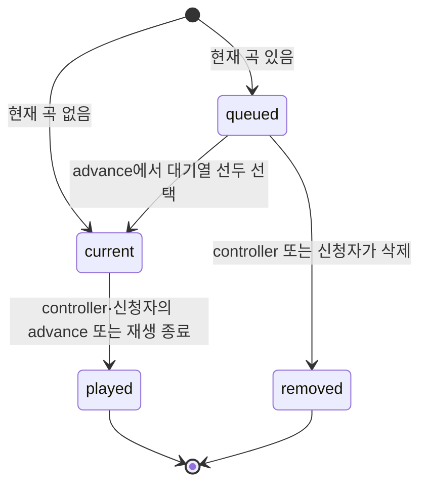

# 데이터 모델

## 1. 개요

데이터는 Node.js 내장 `node:sqlite`의 동기 API로 관리합니다. 파일 DB에는 WAL 모드를, 테스트용 `:memory:` DB에는 기본 저널 모드를 사용하며 모든 연결에서 foreign key 검사를 활성화합니다.

`rooms.manager_participant_id`는 단일 관리자 버전에서 남은 미사용 호환 컬럼입니다. `rooms.current_song_id`는 논리적 참조이지만 현재 스키마에는 foreign key 제약이 선언되어 있지 않습니다.

## 2. `users`와 `auth_sessions`

`users`는 Discord `identify` 응답의 최소 프로필만 저장합니다. `discord_id`는 UNIQUE이며 재로그인 시 `username`, `global_name`, `avatar_hash`, `updated_at`, `last_login_at`을 갱신합니다. 이메일과 OAuth 액세스·리프레시 토큰은 저장하지 않습니다.

`auth_sessions`는 사용자별 로그인 세션입니다. 브라우저에 전달한 32바이트 랜덤 원본 토큰은 저장하지 않고 SHA-256 hex인 `token_hash`만 저장합니다. `user_id`는 `users.id`를 참조하며 사용자 삭제 시 cascade됩니다. `expires_at`이 지난 세션은 인증에 사용할 수 없고 서버 시작 및 1분 정리 주기에 삭제됩니다.

인덱스는 `auth_sessions_by_user(user_id)`, `auth_sessions_by_expiry(expires_at)`을 사용합니다.

## 3. `rooms`

| 컬럼 | 타입/제약 | 의미 |
| --- | --- | --- |
| `id` | TEXT PK | 내부 UUID |
| `code` | TEXT NOT NULL UNIQUE | 사용자에게 노출하는 6자리 방 코드 |
| `host_token_hash` | TEXT NOT NULL | 호스트 원본 토큰의 SHA-256 hex |
| `owner_user_id` | TEXT nullable FK → `users.id`, ON DELETE SET NULL | 로그인한 생성 계정. 비로그인 임시 방은 null |
| `retention_mode` | TEXT, 기본 `legacy` | `legacy`, `temporary`, `permanent` 중 하나 |
| `empty_ttl_hours` | REAL nullable | 임시 방이 빈 뒤 유지되는 시간. 영구 방은 null |
| `max_songs_per_participant` | INTEGER NOT NULL, 기본 2 | 이전 버전 호환을 위해 남겨둔 미사용 컬럼 |
| `manager_participant_id` | TEXT nullable | 이전 버전 호환을 위해 남겨둔 미사용 컬럼 |
| `host_volume` | INTEGER, 기본 100, `0..100` | 호스트 IFrame 플레이어 볼륨 |
| `playback_mode` | TEXT, 기본 `host_only` | `host_only` 또는 `all_devices` |
| `playback_paused` | INTEGER, 기본 0, `0/1` | 논리적 일시정지 상태 |
| `playback_blocked` | INTEGER, 기본 0, `0/1` | 호스트 브라우저 자동재생 차단 상태 |
| `playback_position_seconds` | REAL, 기본 0, 0 이상 | 기준 시각에서의 재생 위치 |
| `playback_anchor_at` | INTEGER, 기본 0 | 기준 위치가 유효한 서버 epoch ms |
| `playback_pending` | INTEGER, 기본 0, `0/1` | 실제 플레이어의 재생 시작을 기다리는 상태 |
| `playback_revision` | INTEGER, 기본 0 | 타임라인 변경 순번 |
| `current_song_id` | TEXT nullable | 현재 곡 ID |
| `empty_since` | INTEGER nullable | 인증된 Socket.IO 연결이 0개가 된 서버 epoch ms |
| `created_at` | INTEGER NOT NULL | 생성 epoch ms |
| `expires_at` | INTEGER NOT NULL | 레거시 방의 고정 만료 epoch ms. 새 방에서는 호환용 값 |

인덱스:

- `rooms.code`의 UNIQUE 인덱스
- `rooms_by_expiry(expires_at)`
- `rooms_by_empty_since(empty_since)`
- `rooms_by_owner_retention(owner_user_id, retention_mode)`

## 4. `participants`

| 컬럼 | 타입/제약 | 의미 |
| --- | --- | --- |
| `id` | TEXT PK | 참여자 UUID |
| `room_id` | TEXT FK → `rooms.id`, ON DELETE CASCADE | 소속 방 |
| `token_hash` | TEXT NOT NULL | 참여자 원본 토큰의 SHA-256 hex |
| `nickname` | TEXT NOT NULL | 표시 이름, 서비스 규칙상 공백 제거 후 `2..20`자 |
| `is_manager` | INTEGER, 기본 0, `0/1` | 공동 관리자 여부 |
| `created_at` | INTEGER NOT NULL | 참여 시각 epoch ms |

제약과 인덱스:

- `UNIQUE(room_id, token_hash)`
- `participants_by_room(room_id)`
- 같은 방의 닉네임 중복은 허용합니다.

## 5. `songs`

| 컬럼 | 타입/제약 | 의미 |
| --- | --- | --- |
| `id` | TEXT PK | 곡 요청 UUID |
| `room_id` | TEXT FK → `rooms.id`, ON DELETE CASCADE | 소속 방 |
| `video_id` | TEXT NOT NULL | YouTube 영상 ID |
| `title` | TEXT NOT NULL | 추가 당시 YouTube 제목 스냅샷 |
| `artist` | TEXT NOT NULL | 추가 당시 채널명 스냅샷 |
| `duration_seconds` | INTEGER NOT NULL | 영상 길이(초) |
| `thumbnail_url` | TEXT NOT NULL | 추가 당시 썸네일 URL |
| `added_by` | TEXT FK → `participants.id`, ON DELETE CASCADE | 신청 참여자 |
| `status` | TEXT CHECK | `queued`, `current`, `played`, `removed` 중 하나 |
| `position` | INTEGER NOT NULL | 대기열 순서 값, 현재 곡은 0 |
| `created_at` | INTEGER NOT NULL | 신청 시각 epoch ms |

인덱스:

- `songs_by_room_status_position(room_id, status, position)`
- `active_video_per_room(room_id, video_id)` partial UNIQUE, 대상 상태는 `queued`, `current`

부분 UNIQUE 인덱스가 애플리케이션의 사전 중복 검사와 별개로 활성 곡 중복을 DB 수준에서도 방지합니다. 이미 `played` 또는 `removed`인 영상은 같은 방에 다시 추가할 수 있습니다.

## 6. `room_feed_entries`

| 컬럼 | 타입/제약 | 의미 |
| --- | --- | --- |
| `sequence` | INTEGER PK AUTOINCREMENT | 채팅과 활동 로그를 함께 정렬하는 전역 순번 |
| `id` | TEXT NOT NULL UNIQUE | 피드 항목 UUID |
| `room_id` | TEXT FK → `rooms.id`, ON DELETE CASCADE | 소속 방 |
| `entry_type` | TEXT CHECK | `message` 또는 `system` |
| `participant_id` | TEXT nullable FK → `participants.id`, ON DELETE SET NULL | 메시지 작성자 또는 동작 수행 참여자 |
| `nickname` | TEXT nullable | 로그가 생성될 당시 참여자 닉네임 스냅샷 |
| `actor_type` | TEXT CHECK | `participant`, `host`, `system` |
| `content` | TEXT nullable | 사용자 메시지 본문 |
| `event_type` | TEXT nullable | 구조화된 방 활동 종류 |
| `event_data` | TEXT nullable | 곡명, 대상 참여자, 이동 위치 등의 JSON |
| `created_at` | INTEGER NOT NULL | 생성 시각 epoch ms |

`room_feed_entries_by_room_sequence(room_id, sequence)` 인덱스를 사용합니다. 조회는 최신 100개를 선택한 뒤 `sequence` 오름차순으로 반환합니다. `sequence`는 일반 메시지와 시스템 로그에 공통으로 발급되므로 같은 밀리초에 생성되어도 순서가 보존됩니다.

시스템 로그 종류는 건너뛰기·대기열 삭제·순서 변경, 전체 일시정지·재개, 참여자 입장·퇴장, 관리자 지정·해제입니다. 곡 추가는 대기열에 신청자가 표시되므로 새 활동 로그를 만들지 않습니다. 표시 문장은 DB에 저장하지 않고 `event_type`과 `event_data`를 프런트에서 현재 언어에 맞게 번역합니다.

`chat_messages`는 이전 버전의 채팅을 마이그레이션하기 위해 유지하는 레거시 테이블입니다. 서버 시작 시 아직 통합 피드에 없는 기존 메시지를 `room_feed_entries`로 복사하며, 새 메시지는 통합 피드에만 기록합니다.

## 7. 곡 상태 전이

- 첫 신청곡은 `current`, 이후 신청곡은 `queued`입니다.
- `advance`는 기존 `current`를 `played`로 바꾸고 `position`, `created_at` 순서상 첫 `queued`를 `current`로 바꿉니다.
- 현재 구현은 `played`와 `removed` 행을 방이 만료될 때까지 유지합니다.
- 대기열 이동은 두 인접 곡의 `position`을 교환합니다. 중간 충돌을 피하기 위해 이동 곡에 임시 음수 값을 넣습니다.

## 8. 핵심 불변식

### 계정과 로그인

- Discord 로그인은 `identify` 범위만 요청합니다.
- OAuth state와 세션 쿠키는 HttpOnly, SameSite=Lax이며 운영 HTTPS에서는 Secure를 사용합니다.
- 원본 로그인 세션 토큰과 Discord OAuth 토큰은 DB에 저장하지 않습니다.
- OAuth `returnTo`는 같은 출처의 절대 경로만 허용합니다.
- 로그인 사용자가 만든 방은 `owner_user_id`로 계정에 연결되며, 소유자는 기기가 바뀌어도 controller 권한을 가집니다.
- 새 방은 로그인한 사용자만 생성하며 모두 계정 소유 방으로 저장합니다.
- 소유자가 재생 호스트를 다시 지정하면 `host_token_hash`를 교체하여 기존 호스트 토큰을 폐기합니다.

### 방

- 코드 문자는 혼동하기 쉬운 `I`, `O`, `0`, `1`을 제외한 알파벳/숫자 집합에서 생성합니다.
- 레거시 고정 만료 시각이 지난 방은 조회·변경할 수 없습니다.
- 임시 방은 모든 인증된 연결이 끊긴 뒤 방에 저장된 `empty_ttl_hours`가 지나면 삭제됩니다.
- 영구 방은 자동 만료·빈 방 정리 대상에서 제외됩니다.
- 첫 참여자가 매니저가 되며 관리자는 다른 참여자의 관리자 상태를 추가하거나 해제할 수 있습니다.
- 최소 한 명의 관리자를 유지하고, 온라인 관리자가 없으면 가장 오래 접속 중인 일반 참여자를 추가 관리자로 승격합니다.
- 재생 모드는 방 생성 시 `host_only` 또는 `all_devices`로 고정됩니다.
- 재생 중 예상 위치는 기준 위치에 `현재 서버 시각 - playback_anchor_at`을 더해 계산합니다.

### 참여자와 권한

- 원본 토큰은 저장하지 않고 해시만 저장합니다.
- 참여자 토큰은 해당 방의 참여자 한 명과 매칭되어야 합니다.
- 매니저 작업은 참여자의 `is_manager`가 1이어야 합니다.
- controller 작업은 올바른 호스트 토큰, 관리자 토큰 또는 방 소유자 로그인 세션 중 하나가 필요합니다.
- 일반 참여자는 `songs.added_by`가 자신의 ID인 현재 곡을 건너뛰거나 대기 곡을 삭제할 수 있습니다.

### 신청곡

- 한 방에는 같은 `video_id`의 활성 곡이 둘 이상 존재할 수 없습니다.
- 직접 추가되는 영상은 YouTube 조회 시 공개·비라이브·임베드 가능 상태여야 합니다.
- 대기열 조회는 `position ASC, created_at ASC`로 안정적으로 정렬합니다.

### 채팅

- 유효한 참여자 토큰이 있는 사용자만 기록을 조회하거나 메시지를 전송할 수 있습니다.
- 메시지는 일반 텍스트로 저장하며 앞뒤 공백을 제거한 뒤 `1..300`자를 검증합니다.
- 사용자 메시지와 시스템 활동 로그는 하나의 증가 순번을 공유합니다.
- 로그의 참여자가 사라져도 당시 닉네임 스냅샷과 로그 내용은 유지합니다.
- 삭제 기능과 채팅 전용 요청 제한은 제공하지 않습니다.

## 9. 트랜잭션 경계

`rooms.js`의 다음 변경은 `BEGIN IMMEDIATE` / `COMMIT`으로 처리되고 실패 시 `ROLLBACK`됩니다.

- 참여
- 곡 추가
- 다음 곡 전환
- 재생/자동재생 차단 상태 변경
- 곡 삭제 및 순서 변경
- 방 설정 변경
- 매니저 추가·해제
- 온라인 매니저 부재 시 자동 승격
- 채팅 메시지 추가
- 시스템 활동 로그 추가
- Discord 사용자 upsert와 로그인 세션 생성

`BEGIN IMMEDIATE`는 쓰기 예약 잠금을 먼저 획득하므로 한도 및 중복 검사 뒤 삽입 사이의 동시 쓰기 경쟁을 줄입니다. 현재 모든 DB 작업은 단일 Node.js 프로세스 안에서 동기 실행됩니다.

## 10. 스키마 초기화와 마이그레이션

`createDatabase()`는 시작할 때 `CREATE TABLE IF NOT EXISTS`와 인덱스 생성을 실행합니다. 기존 DB에 다음 `rooms` 컬럼이 없으면 `ALTER TABLE`로 추가합니다.

- `manager_participant_id`
- `host_volume`
- `playback_paused`
- `playback_blocked`
- `playback_mode`
- `playback_position_seconds`
- `playback_anchor_at`
- `playback_pending`
- `playback_revision`
- `empty_since`
- `owner_user_id`
- `retention_mode`
- `empty_ttl_hours`

기존 `participants` 테이블에 `is_manager`가 없으면 컬럼을 추가하고, 레거시 `manager_participant_id`가 가리키던 참여자를 관리자로 변환합니다. 레거시 포인터가 없는 방은 생성 시각이 가장 빠른 참여자를 관리자로 지정한 뒤 포인터를 비웁니다. 현재 별도의 스키마 버전 테이블이나 마이그레이션 파일은 없습니다.

`room_feed_entries`가 생성되면 기존 `chat_messages` 중 동일한 ID가 없는 행을 생성 시각과 레거시 `rowid` 순서로 복사합니다. `INSERT OR IGNORE` 방식이므로 서버를 다시 시작해도 중복되지 않습니다.

## 11. 만료와 삭제

- 기존 방은 `legacy`로 마이그레이션되어 기존 `expires_at`과 전역 빈 방 TTL 규칙을 유지합니다.
- 새 방은 로그인 계정에 귀속되며 자동 삭제하지 않습니다.
- 기존 임시 방은 유효한 연결이 모두 끊긴 시점부터 저장된 TTL을 적용하는 하위 호환을 유지합니다.
- 유효한 호스트, 소유자 또는 참여자 세션으로 연결된 Socket.IO 클라이언트가 하나도 없으면 `empty_since`를 기록하고, 다시 연결되면 비웁니다.
- 참여자 온라인 상태는 DB에 저장하지 않고 Socket.IO 연결을 기준으로 메모리에서 관리합니다. 마지막 소켓 종료 후 `PARTICIPANT_LEAVE_GRACE_MS` 동안 재연결되지 않으면 참여자 목록에서 제외합니다.
- 서버 시작 시 모든 방을 빈 상태로 표시하며, 재연결된 방은 삭제 대상에서 제외합니다.
- 서버 시작 시와 이후 1분마다 레거시 만료 방과 TTL을 넘긴 임시 방을 삭제합니다.
- 방 삭제는 foreign key cascade로 참여자, 곡, 채팅 피드를 함께 삭제합니다.
- 임시 방 TTL은 마지막 활성 연결이 끊긴 시점부터 다시 계산됩니다.
- 로그인 세션은 기본 30일 뒤 만료되며 만료 시 자동 연장하지 않습니다.

## 12. 백업 고려사항

파일 DB는 WAL 모드이므로 실행 중 파일 복사만으로 백업할 때는 본 DB와 `-wal`, `-shm`의 일관성을 고려해야 합니다. 운영 백업은 SQLite의 일관된 백업 방식 또는 서비스를 안전하게 중지한 뒤 볼륨을 복제하는 방식이 적합합니다. 복원 전에는 현재 DB 볼륨의 별도 사본을 보관하고, 복원 후 `/api/health`와 방 생성/조회 동작을 확인합니다.
