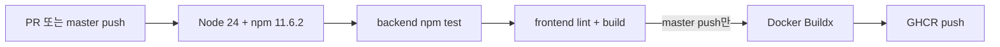

# 개발 및 운영 가이드

## 1. 요구 사항

- Node.js 24 이상
- npm 11.6.2 권장(`packageManager` 및 Dockerfile 기준)
- YouTube Data API v3 키
- 프로덕션 공개 시 HTTPS를 권장하며, 프록시 사용 시 WebSocket upgrade 지원 필요

## 2. 환경 변수

백엔드 개발 환경은 `backend/.env.example`, Compose 이미지 배포는 `jukebox.env.example`을 기준으로 합니다.

| 변수 | 기본값 | 필수 여부 | 설명 |
| --- | --- | --- | --- |
| `PORT` | `3001` | 선택 | HTTP/Socket.IO 수신 포트 |
| `DATABASE_PATH` | `./data/jukebox.sqlite` | 선택 | SQLite 파일 경로 |
| `PARTICIPANT_LEAVE_GRACE_MS` | `5000` | 선택 | 마지막 연결 종료 후 참여자를 오프라인 처리하기까지의 유예 시간(ms) |
| `YOUTUBE_API_KEY` | 없음 | YouTube 기능에 필수 | YouTube Data API v3 키 |
| `TRUST_PROXY` | 백엔드 기본값 `false`, Compose 기본값 `true` | 프록시 구성에 따라 | `true`이면 Express가 한 단계 프록시의 클라이언트 IP를 신뢰 |
| `JUKEBOX_PORT` | `3001` | 로컬 Compose에서 선택 | `compose.yaml`에서 호스트에 공개할 포트. 운영 Compose는 호스트 포트를 공개하지 않음 |
| `DISCORD_CLIENT_ID` | 없음 | 방 생성에 필수 | Discord 애플리케이션 Client ID |
| `DISCORD_CLIENT_SECRET` | 없음 | 방 생성에 필수 | 서버에서만 사용하는 Discord Client Secret |
| `DISCORD_REDIRECT_URI` | 없음 | 방 생성에 필수 | Developer Portal에 등록한 정확한 OAuth2 callback URL |
| `BROWSER_EXTENSION_IDS` | 없음 | Chrome 확장 프로그램 사용 시 필수 | 허용할 확장 프로그램 ID, 여러 개면 쉼표로 구분 |
| `AUTH_SESSION_TTL_DAYS` | `30` | 선택 | 로그인 세션 고정 수명(일) |
| `AUTH_COOKIE_SECURE` | 백엔드 production 및 Compose 기본값 `true` | HTTPS 운영에서 `true` | 로그인 쿠키의 `Secure` 속성 |

YouTube API 키는 프런트 코드나 `VITE_*` 환경 변수에 넣지 않습니다.
Discord Client Secret도 서버 환경 변수에만 둡니다. 세 Discord 설정값이 모두 있어야 로그인과 새 방 생성이 가능합니다. 기존 방 참여는 로그인 없이도 가능합니다.

Discord Developer Portal의 **OAuth2 → Redirects**에는 로컬 개발 시 `http://localhost:5173/api/auth/discord/callback`, HTTPS 운영 시 `https://bside.whitekw.com/api/auth/discord/callback`을 등록합니다. 설정값은 대소문자, 포트, 경로, trailing slash까지 완전히 일치해야 합니다. HTTP에서 전환할 때는 HTTPS callback을 먼저 추가한 다음 Portainer의 `DISCORD_REDIRECT_URI`를 변경하고, 로그인 확인 후 기존 HTTP callback을 제거합니다. HTTPS 운영에서는 `AUTH_COOKIE_SECURE=true`를 사용합니다.

운영 대시보드의 변경 요청은 `DISCORD_REDIRECT_URI`의 출처(프로토콜·호스트·포트)를 공개 주소로 검증합니다. 프록시가 HTTPS를 종료하거나 내부 Host로 전달해도 공개 주소가 이 설정과 일치하면 세션 해제·기록 삭제를 처리합니다. `TRUST_PROXY`의 클라이언트 IP 신뢰 설정과는 별개이며, 전달 헤더만으로 외부 출처를 허용하지 않습니다.

Chrome 확장 프로그램은 [`extension/README.md`](../extension/README.md)의 설치 절차를 따릅니다. OAuth의 Discord callback은 `DISCORD_REDIRECT_URI`를 사용하며, 완료 후 허용된 `https://{확장 ID}.chromiumapp.org/bside`로 일회용 코드만 보냅니다. HTTPS 전환 시 확장 프로그램도 `https://bside.whitekw.com`을 대상으로 다시 빌드해야 합니다.

## 3. 로컬 개발

백엔드:

```powershell
cd backend
Copy-Item .env.example .env
npm install
npm run dev
```

프런트엔드:

```powershell
cd frontend
npm install
npm run dev
```

접속 주소는 `http://localhost:5173`입니다. Vite 개발 서버는 `/api`와 `/socket.io`를 `http://localhost:3001`로 프록시합니다.

## 4. 검증 명령

```powershell
cd backend
npm test

cd ..\frontend
npm run lint
npm run build
```

현재 자동 검증 범위:

- 새 DB 스키마 생성과 구버전 스키마 거부
- Discord OAuth2 URL, 계정 upsert, 해시 세션, 만료와 쿠키 보안 유틸리티
- 방 생성, 참여, 곡 추가/한도/중복, 다음 곡 전환
- 재생 모드 기본값/검증과 공유 재생 타임라인 계산
- 호스트/공동 관리자 권한, 재생 상태, 설정, 관리자 추가·해제와 접속 해제 시 권한 유지
- 국가/언어 판별
- YouTube URL 파싱, 재생 가능성 필터, 인기 차트 캐시와 지역 폴백
- 프런트 정적 lint, TypeScript 빌드

## 5. 로컬 프로덕션 실행

```powershell
cd frontend
npm ci
npm run build

cd ..\backend
npm ci
npm start
```

Express가 `frontend/dist`를 제공하므로 최종 런타임에는 포트 3001 하나만 노출하면 됩니다.

## 6. Docker Compose

### 소스에서 빌드

`backend/.env`에 실제 API 키를 설정한 뒤 실행합니다.

```bash
docker compose up -d --build
docker compose ps
docker compose logs -f jukebox
```

구성 특성:

- 멀티 스테이지 Dockerfile에서 프런트를 빌드하고 백엔드 production dependency만 런타임에 복사합니다.
- 런타임 프로세스는 비루트 `node` 사용자로 실행됩니다.
- `/app/data`는 `jukebox-data` named volume에 연결됩니다.
- healthcheck는 30초마다 `/api/health`를 조회합니다.

중지:

```bash
docker compose down
```

`docker compose down -v`는 SQLite 영속 볼륨까지 삭제하므로 데이터 폐기가 명확히 필요한 경우에만 사용합니다.

### 기존 DB 초기화

현재 SQLite 스키마는 버전 3입니다. 버전 1·2 DB는 자동 업그레이드하며 기존 방·참여자·로그인 세션을 보존합니다. 기존 방의 제목은 방 코드로, 비로그인 참여는 허용으로 설정됩니다. 버전 1보다 오래된 DB는 초기화 안내 오류와 함께 시작을 중단합니다. 업그레이드 전에는 SQLite 볼륨을 백업하세요.

- 로컬 실행: 백엔드를 중지한 뒤 `DATABASE_PATH`가 가리키는 DB 파일과 같은 이름의 `-wal`, `-shm` 파일을 제거하고 다시 시작합니다. 기본 경로는 `backend/data/jukebox.sqlite`입니다.
- `compose.yaml`: 서비스를 중지한 뒤 해당 프로젝트의 `jukebox-data` 볼륨을 제거하고 다시 생성합니다. 다른 프로젝트가 같은 이름의 볼륨을 사용하는지 확인하세요.
- Portainer의 `compose.deploy.yaml`: Stack을 중지한 뒤 외부 볼륨 `jukebox-data`를 제거하고, 동일한 이름으로 새 볼륨을 만든 뒤 Stack을 배포합니다. Stack 재배포만으로는 외부 볼륨이 초기화되지 않습니다.

### 게시 이미지로 배포

`compose.deploy.yaml`은 GHCR의 commit SHA 이미지, 외부 `jukebox-data` 볼륨과 외부 `proxy` 네트워크를 사용합니다. 운영 서버에 `proxy` 네트워크가 있어야 하며, 리버스 프록시 컨테이너도 같은 네트워크에 연결되어 있어야 합니다. 운영 Compose는 호스트 포트를 공개하지 않고 프록시가 `jukebox:3001`로 접속합니다.

```bash
docker volume create jukebox-data
cp jukebox.env.example jukebox.env
docker compose --env-file jukebox.env -f compose.deploy.yaml up -d
```

운영 Compose는 다음 방어 설정을 적용합니다.

- 읽기 전용 root filesystem
- `/tmp` tmpfs
- `no-new-privileges`
- Linux capability 전체 제거
- `unless-stopped` 재시작 정책

## 7. 리버스 프록시 요구사항

- 외부 트래픽은 HTTPS로 종료합니다.
- 일반 HTTP와 `/socket.io/`의 WebSocket upgrade를 모두 백엔드 포트로 전달합니다.
- 운영 Compose에서는 `proxy` 네트워크의 `jukebox:3001`로 전달합니다. 호스트의 `127.0.0.1:3001`로는 접속할 수 없습니다.
- 프록시가 실제 클라이언트 IP를 전달하고 토폴로지가 한 단계일 때 `TRUST_PROXY=true`를 사용합니다.
- Cloudflare를 사용하는 경우 `CF-IPCountry`가 지역별 차트와 추천 언어에 사용됩니다.
- 연결 유휴 시간 제한이 너무 짧으면 Socket.IO가 자주 재연결될 수 있습니다.

## 8. CI/CD

`.github/workflows/container.yml`은 `master` 대상 pull request와 push에서 실행됩니다.



게시 태그:

- `ghcr.io/whitekw/jukebox:master`
- `ghcr.io/whitekw/jukebox:sha-{git-sha}`

운영 Compose는 재현 가능한 SHA 태그를 사용합니다. `master` 게시가 끝나면 CI가 `compose.deploy.yaml` 전체를 `deploy` 브랜치로 복사한 뒤 이미지 태그를 갱신합니다. Portainer의 Git Stack은 갱신된 `deploy` 브랜치를 다시 배포해야 새 환경 변수 매핑을 적용합니다.

## 9. 운영 점검

### 상태 확인

```bash
docker compose --env-file jukebox.env -f compose.deploy.yaml exec jukebox node -e "fetch('http://127.0.0.1:3001/api/health').then(r=>{if(!r.ok)process.exit(1)}).catch(()=>process.exit(1))"
docker compose --env-file jukebox.env -f compose.deploy.yaml ps
docker compose --env-file jukebox.env -f compose.deploy.yaml logs --tail=200 jukebox
```

애플리케이션 로그는 현재 시작 메시지와 처리되지 않은 5xx 오류를 표준 출력/오류에 기록합니다. 구조화 로그, access log, metrics 엔드포인트는 아직 없습니다.

### 데이터

- `jukebox-data` 볼륨 사용 여부와 여유 공간을 확인합니다.
- 방은 계정 소유자가 직접 삭제할 때까지 유지됩니다.
- 만료된 로그인 세션은 시작 시와 1분 간격으로 삭제됩니다.
- 백업 시 WAL 일관성을 고려합니다. 자세한 내용은 [DATA_MODEL.md](./DATA_MODEL.md)를 참고합니다.

### YouTube 연동

- 키가 없으면 YouTube 검색·곡 추가가 `YOUTUBE_NOT_CONFIGURED`로 실패하지만 방 생성/조회는 동작합니다.
- 외부 연결 실패는 `YOUTUBE_UNAVAILABLE`, API 응답 오류는 `YOUTUBE_API_ERROR`입니다.

## 10. 장애 대응 메모

| 증상 | 우선 확인 |
| --- | --- |
| 로그인 기능을 사용할 수 없음 | `/api/auth/session`의 `enabled` 확인. `false`이면 Portainer 변수 값뿐 아니라 배포 중인 `compose.deploy.yaml`의 `DISCORD_CLIENT_ID`, `DISCORD_CLIENT_SECRET`, `DISCORD_REDIRECT_URI` 컨테이너 전달 설정 확인 |
| 방 화면은 열리나 실시간 갱신 안 됨 | 리버스 프록시의 WebSocket upgrade, `/socket.io/` 전달, 브라우저 네트워크 탭 |
| 모든 사용자가 같은 IP로 제한됨 | 프록시 전달 헤더와 `TRUST_PROXY` 설정 |
| 검색/추가만 실패 | `YOUTUBE_API_KEY`, 외부 연결, YouTube API 오류 응답 |
| 컨테이너 재생성 후 방 소실 | `/app/data`의 named volume 연결 여부 |
| 호스트 제어 불가 | 해당 브라우저의 `jukebox:host:{CODE}` localStorage 키 존재 여부 |
| 참여자 재입장 요구 | 해당 브라우저의 참여자 토큰 삭제/불일치 또는 멤버십 탈퇴 여부 |
| 자동재생 차단 표시 | 해당 기기에서 `재생 계속` 사용, 호스트 전용 모드라면 호스트 브라우저의 자동재생 정책도 확인 |

`host_only` 방의 호스트 토큰을 잃은 경우 방 소유자가 로그인해 현재 기기를 새 호스트로 지정할 수 있습니다. 기존 원본 토큰은 복구할 수 없습니다. 모든 기기 재생 방에는 호스트 토큰이 없습니다.

## 11. 운영 변경 전 체크리스트

- 배포 이미지가 CI를 통과한 SHA 태그인지 확인
- SQLite 볼륨 백업 또는 스냅샷 확보
- 필수 환경 변수와 비밀 값 노출 여부 확인
- 리버스 프록시의 HTTPS 및 WebSocket 경로 확인
- 배포 후 healthcheck, 홈 로드, 방 생성, 참여, 실시간 갱신 확인
- 문제 시 되돌릴 이전 이미지 태그와 DB 백업 위치 확인
